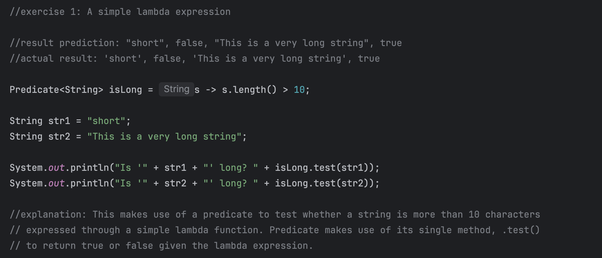

# Lab: Exploring Java Lambdas and Predicate

### by: Ivan Patrick Frondozo

## Description:
This simple Java program allows us to learn about what Lambda and Predicate expressions are and their basic use-cases through guided exercises.

## Output:

### Exercise 1: "The New Way" - A Simple Lambda Expression

### Exercise 2: Using Predicates to Filter a List

### Exercise 3: Chaining Predicates 

